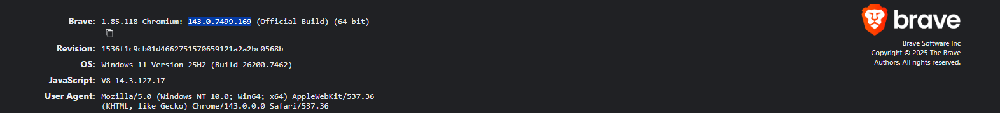
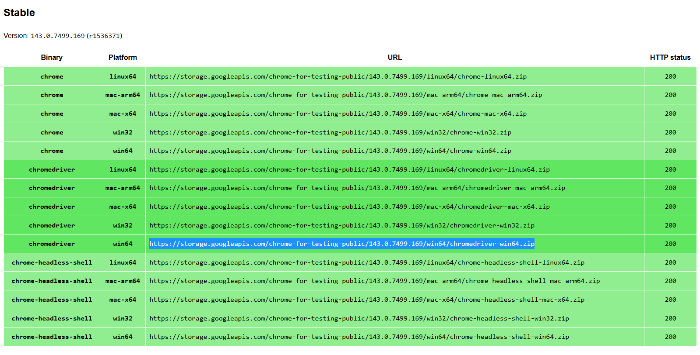
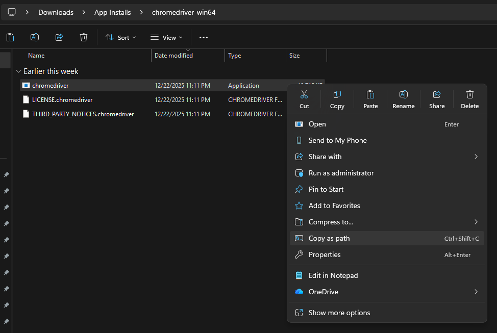
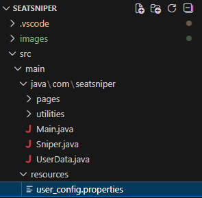
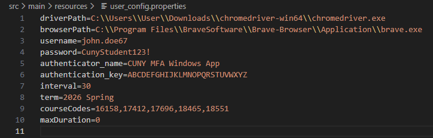
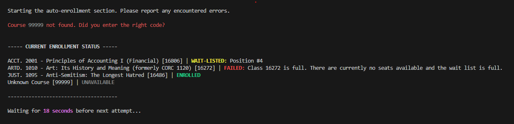

# <p align="center">Seat Sniper</p>

<p align="center">*A course enrollment automation tool for CUNY students. Provides better chances at securing seats in their desired courses for the current or upcoming semester. The tool periodically checks for seat openings and automatically enrolls if any are available. Ultimately saving time, reducing stress during finals, and helping students avoid poorly rated professors or a delayed graduation.*</p>


## Table of Contents

- [Features](#features)
- [Prerequisites](#prerequisites)
- [Installation](#installation)
- [Configuration](#configuration)
- [Usage](#usage)
- [Planned Features](#planned-features)
- [Important Notes](#important-notes)
- [Contributing](#contributing)
- [Support](#support)
- [License](#license)


## Features

- **Automated Course Enrollment**: Periodically checks for available seats and automatically enrolls when spots open up
- **Multi-Course Support**: Monitor and enroll in multiple courses simultaneously
- **Configurable Intervals**: Customize the cooldown period between enrollment attempts
- **Time-Limited Execution**: Set a maximum duration for the automation to run, or let it run indefinitely
- **MFA Support**: Integrated support for CUNY's multi-factor authentication system


## Prerequisites

Before you begin, ensure you have a list of desired course section codes.

- The tool uses the **number** portion of a **section code** 
- To find desired course section codes, navigate Schedule Builder and note them for later.
  - [Check here](#how-to-find-section-codes) for more information on how to obtain a course section code.

Before you begin, ensure you have the following installed:

- **Git** (for cloning the repository)
- **Java 21** or higher ([Download Java](https://www.oracle.com/java/technologies/downloads/))
- **Maven** ([Download Maven](https://maven.apache.org/download.cgi))
- **Chrome Browser** (or Chromium-based browser like Brave)
- **ChromeDriver** (matching your browser version)


## Installation

### Step 1: Clone the Repository

Clone this repository to your local machine:

```bash
git clone https://github.com/Jraculea/SeatSniper.git
cd SeatSniper
```

Alternatively, you can download the project as a ZIP file and extract it to your desired location.

### Step 2: Download ChromeDriver

1. **Check your Chrome/Browser version**:
   - Open Chrome (or your Chromium-based browser)
   - Go to `chrome://version/` (or `brave://version/` for Brave)
   - Note the Chromium version number

   

2. **Download the matching ChromeDriver**:
   - Visit the [ChromeDriver Downloads page](https://googlechromelabs.github.io/chrome-for-testing/#stable)
   - Select the version that matches your browser (`xxx.xx.xxxx.00` all the `x`s must match your browser version, but the `0`s don't need to)
   - Download the appropriate file for your operating system (Windows, macOS, or Linux)

   

3. **Extract ChromeDriver**:
   - Extract the downloaded file to a location you can easily access
   - Note the full path to the `chromedriver.exe` file (Windows) or `chromedriver` executable (macOS/Linux)
   - Example Windows path: `C:\Users\User\Downloads\chromedriver-win64\chromedriver.exe`

   

   > **Helpful Links:**
   > - [ChromeDriver Official Downloads](https://googlechromelabs.github.io/chrome-for-testing/#stable)
   > - [ChromeDriver Documentation](https://chromedriver.chromium.org/)


### Step 3: Build the Project

Navigate to the project directory and build it using Maven:

```bash
mvn clean install
```

This will download all required dependencies and compile the project.


## Configuration

### Step 4: Configure the Properties File

1. **Locate the configuration file**:
   - Navigate to `src/main/resources/user_config.properties`
   - Open it in your preferred text editor

   

2. **Fill in your information**:

   Open the `user_config.properties` file and configure the following settings:

   

   | Property | Description | Example |
   |----------|-------------|---------|
   | `driverPath` | Full path to your ChromeDriver executable | `C:\\Users\\User\\Downloads\\chromedriver-win64\\chromedriver.exe` |
   | `browserPath` | Full path to your browser executable | `C:\\Program Files\\Google\\Chrome\\Application\\chrome.exe` |
   | `username` | Your CUNY username (without @login.cuny.edu) | `john.doe67` |
   | `password` | Your CUNY password | `CunyStudent123!` |
   | `authenticator_name` | Name of your authenticator app | `CUNY MFA Windows App` |
   | `authentication_key` | Your authenticator secret key | `ABCDEFGHIJKLMNOPQRSTUVWXYZ` |
   | `interval` | Cooldown in seconds between enrollment attempts | `30` |
   | `term` | The term you want to enroll in | `2026 Spring` |
   | `courseCodes` | Comma-separated list of section codes | `16158,18551,17412,17696,18465` |
   | `maxDuration` | Maximum duration in seconds (0 = indefinite) | `0` |

   **Configuration Details:**

   - **`driverPath`**: Use double backslashes (`\\`) for Windows paths, or forward slashes (`/`) for all platforms
   - **`browserPath`**: Common locations:
     - Chrome: `C:\\Program Files\\Google\\Chrome\\Application\\chrome.exe`
     - Brave: `C:\\Program Files\\BraveSoftware\\Brave-Browser\\Application\\brave.exe`
   - **`interval`**: 
     - **Recommended**: At least 30 seconds to avoid overwhelming the system
     - **Minimum**: 0 or more (can run continuously)
     - Lower intervals may increase the chance of detection or rate limiting
   - **`maxDuration`**: 
     - **Default**: `0` (runs indefinitely until manually stopped)
     - **Set a value**: Number of seconds the tool will run (e.g., `3600` = 1 hour)
   - **`courseCodes`**: 
     - Separate multiple section codes with commas
     - No spaces after commas (e.g., `16158,18551`)
   - **`term`**: 
     - Format: `YYYY Season` (e.g., `2026 Spring`, `2025 Fall`)

   **Example Configuration:**

   ```properties
   driverPath=C:\\Users\\User\\Downloads\\chromedriver-win64\\chromedriver.exe
   browserPath=C:\\Program Files\\Google\\Chrome\\Application\\chrome.exe
   username=john.doe67
   password=CunyStudent123!
   authenticator_name=CUNY MFA Windows App
   authentication_key=ABCDEFGHIJKLMNOPQRSTUVWXYZ
   interval=30
   term=2026 Spring
   courseCodes=16158,18551,17412,17696,18465
   maxDuration=0
   ```

   

   > **Helpful Links:**
   > - [How to Find Your Browser Path](https://support.google.com/chrome/answer/95346)
   > - [CUNY MFA Setup Guide](https://employees.brooklyn.edu/base/cuny-mfa-setup/)
   > - [How to find section codes](https://www.cuny.edu/wp-content/uploads/sites/4/page-assets/about/administration/offices/registrar/resources/schedulebuilder/SB-Advisor-Guide_01.22.2021.pdf#page=21) <a name="how-to-find-section-codes"></a>


## Usage

### Step 5: Run the Application

Once you've configured all the settings, you can run the application:

```bash
mvn exec:java -Dexec.mainClass="com.seatsniper.Main"
```

Or if you prefer to compile and run manually:

```bash
mvn compile
java -cp target/classes com.seatsniper.Main
```

### How It Works

1. **Initialization**: The tool sets up the Selenium WebDriver using your configured browser and driver paths
2. **Authentication**: Opens CUNYFirst and logs into your CUNY account using your credentials
3. **MFA Verification**: Handles multi-factor authentication using your authenticator app
4. **Eligibility Check**: Verifies your enrollment eligibility for the semester (current date relative to your appointment date)
5. **Term Selection**: If eligible, navigates to Schedule Builder and selects the specified enrollment term
6. **Enrollment Loop**: 
   - Continuously checks for available seats in your specified courses
   - Automatically attempts enrollment when seats become available
   - Waits for the configured interval between attempts
   - Runs for the specified `maxDuration` (or indefinitely if set to 0), or once all courses have been enrolled in
7. **Feedback**: 
   - Outputs the status of each course every attempt (i.e., enrolled, wait-listed, failed (full), unavailable (unknown course code))
   

### Stopping the Application

To stop the application:
- Enter `Ctrl + C` in the terminal/command prompt
- The application will gracefully shut down and close the browser


## Planned Features

- Enrollment in courses from multiple CUNY colleges
- Moving from terminal output to webhooks for the status of courses
- Fetching recommended courses based on DegreeWorks and professor reviews (i.e., faculty evaluations and RateMyProfessor)
- Scaling to SAAS(?)


## Important Notes

- **Rate Limiting**: Keep the `interval` at a reasonable value (30+ seconds recommended) to avoid being rate-limited or flagged
- **Security**: Never commit your `user_config.properties` file with real credentials to version control
- **Browser Updates**: If you update your browser, you may need to download a new ChromeDriver version
- **Account Safety**: Use this tool responsibly and in accordance with CUNY's terms of service


## License

See the [LICENSE](LICENSE) file for details.


## Contributing

- Support the project by giving it a star 🌟 Thanks!
- Contributions are welcome! Please feel free to submit a Pull Request.


## Support

If you encounter any issues or have questions, please open an issue on the [GitHub repository](https://github.com/Jraculea/SeatSniper/issues).

---

⚠️ **Disclaimer**: This tool is for educational purposes. Use responsibly and in accordance with CUNY's terms of service. The developer(s) is not responsible for any misuse of this software.
